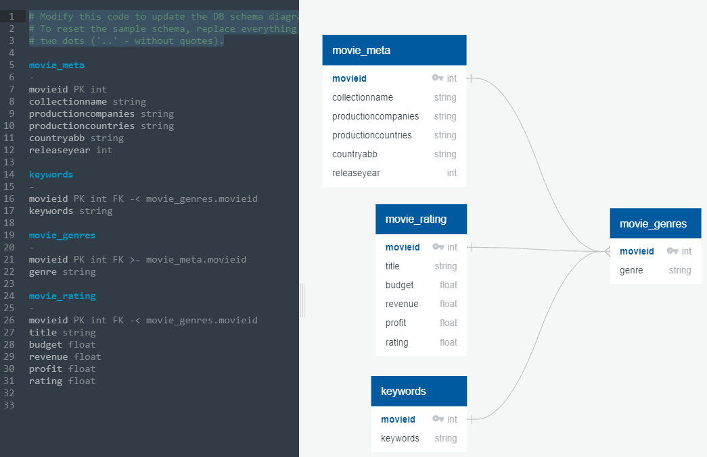
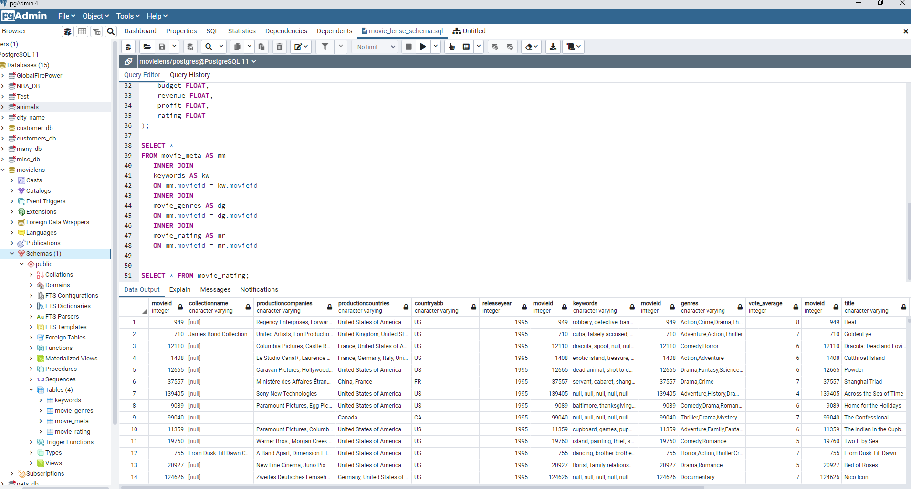

## **Project: MovieLens Database** 

**GitHub: **https://github.com/dany-roman/project_2

**Team:** Dany, Iryna, Ulises, Revathi

**Project Description:** Creating a MovieLens database using python, PostgreSQL, and a smaller selection of data.

## **Data:** 

The MovieLens dataset contains data for over 45,00 movies released before Jul 2017. Data includes genre, keywords, budget, revenue, languages, reviews and more.

Dataset location: https://www.kaggle.com/rounakbanik/the-movies-dataset?select=credits.csvThis 

File names:

- **movies_metadata.csv**: Contains information on 45,000 movies featured in the Full MovieLens dataset.

- **keywords.csv**: Contains the movie plot keywords for our MovieLens movies.

- **credits.csv**: Consists of Cast and Crew Information for all our movies. 

- **ratings_small.csv**: The subset of 100,000 ratings from 700 users on 9,000 movies.And more...

  

## General ETL Approach:

#### *Extract*

The MovieLens dataset was downloaded and stored in a Data folder of the Project 2 repository (was not uploaded due to the file size). Pandas was used to read the CSV files and display as separate dataframes. 

#### *Transform*

Ratings timestamp was converted to a date. Unnecessary columns, such as “adult”, “status”, “video” were removed to reduce data file size. Various columns, such as the keywords in the keywords.csv file or production data in the movies_metadata.csv, were stored as a JSON and parsed out. Budget data was merged with the movie titles. 
Profit for each movie was calculated in the rating dataset, along with the average rate from several users on 9,000 movies

#### *Load*

All final data frames were exported to a postgreSQL database. 

##### **ERD diagram**

ERD diagram was designed using [QuickDBD (quickdatabasediagrams.com)](https://app.quickdatabasediagrams.com/#/) online tool and represented one-to-many relationship between the following tables on primary key column - movieid:

* movie_meta (one) to movie_genres (many);
* movie_rating (one) to movie_genres (many);
* keywords (one) to movie_genres (many)

### Loading:

For the LOAD portion of the project, we have selected PostgreSQL and SQLAlchemy to implement this step.

Following was sequence of operations performed by the team:

1. A new **movielens** database was created in pgAdmin. Within it, using the below sql schema, 4 tables were initialized:

   <section style="background-color: #EEEEEE; font-family:Courier New; font-weight:bold; padding:20px">CREATE TABLE movie_meta ( 
        &emsp;movieid INT PRIMARY KEY, 
        &emsp;collectionname VARCHAR, 
        &emsp;productioncompanies VARCHAR, 
        &emsp;productioncountries VARCHAR, 
        &emsp;countryabb VARCHAR, 
        &emsp;releaseyear INT ); 
         
       CREATE TABLE keywords ( 
        &emsp;movieid INT PRIMARY KEY, 
        &emsp;keywords VARCHAR ); 
         
       CREATE TABLE movie_genres( 
        &emsp;movieid INT PRIMARY KEY, 
        &emsp;genre VARCHAR ); 
         
       CREATE TABLE movie_rating ( 
        &emsp;movieid INT PRIMARY KEY, 
        &emsp;title VARCHAR, 
        &emsp;budget FLOAT, 
        &emsp;revenue FLOAT, 
        &emsp;profit FLOAT, 
        &emsp;rating FLOAT );
   </section>

2. Then inside Jupyter notebook using the create_engine function from sqlalchemy we uploaded the data
   <section style="background-color: #EEEEEE; font-family:Courier New; font-weight:bold; padding:20px">
   # Import sqlalchemy engine 
   from sqlalchemy import create_engine  
   # setup connection 
   rds_connection_string = "postgres:postgres@localhost:5432/movielens" 
   engine = create_engine(f'postgresql://{rds_connection_string}')
   </section>

   Finally use Pandas to_sql function to write data into the database (shown below is an example of the movie_genres table upload)

   <section style="background-color: #EEEEEE; font-family:Courier New; font-weight:bold; padding:20px">
   movie_genres_4.to_sql(name='movie_genres', 
        &emsp;&emsp;&emsp;con=engine, 
        &emsp;&emsp;&emsp;if_exists='append', 
        &emsp;&emsp;&emsp;index=False)</section>

Below is the snapshot of pgAdmin worplace:

